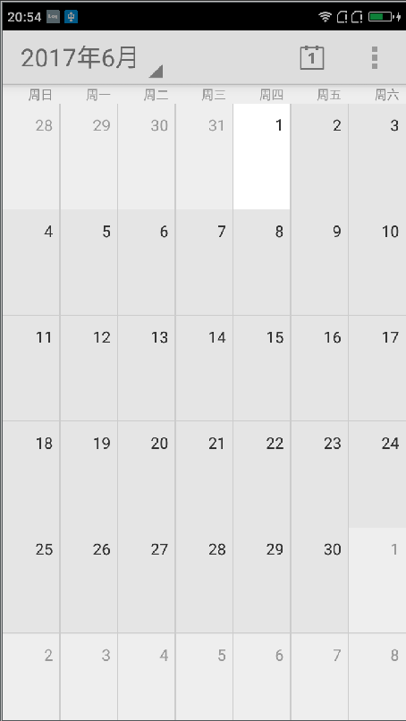
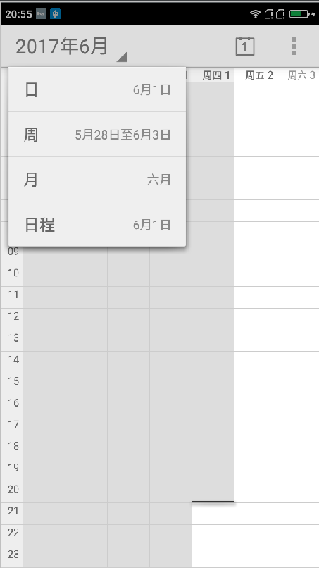
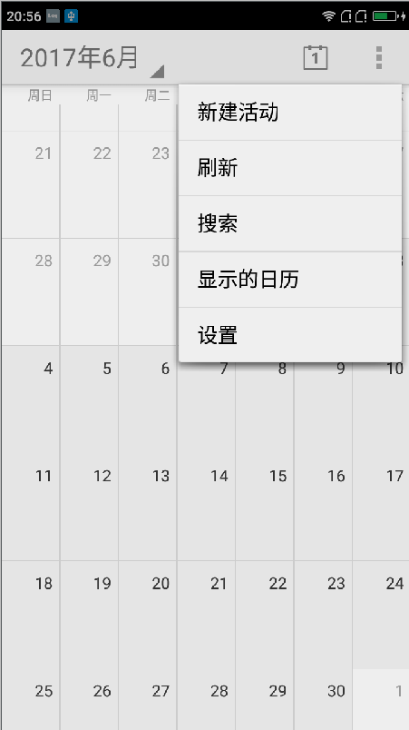

# Android 4.4 日历源代码

本日历代码是直接从Android4.4代码中抽离出来的，本项目依赖的系统库比较多，于是我将需要的依赖的库
源代码都通过Module的形式引入进来了，本项目之所以单独弄出来是方便大家可以看看如果要实现一个日历
的功能应该如何做，然后自定义控件等等功能，虽然它没有市面上的那些日历这么花哨，但是可以说这个是日
历的始祖，其实很多的日历都是有可能基于这个进行二次开发然后在上面动动UI界面，然后加入一些什么动画
效果的，这里为了不让大家重复造轮子就将该项目单独拿出来编译，下面看看其效果图：

